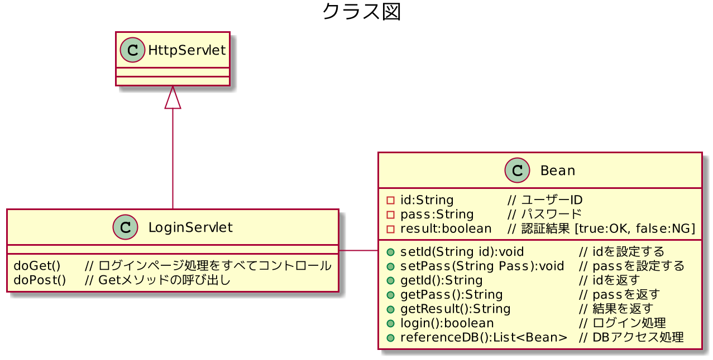

# SQL injectionの実装と対策用

## 1. 概要
SQL injectionを実装をし、対策を講じる。

## 2. 目的
* SQL injectionという用語だけを知識として知っていても、
  全く意味を成さない。
* 実装を自分で行うことにより、より現実味を味わう。
* 対策を講じることにより、セキュリティに対する認識を高める。

## 3. 詳細設計

### Class Diagram

### Sequence Diagram
